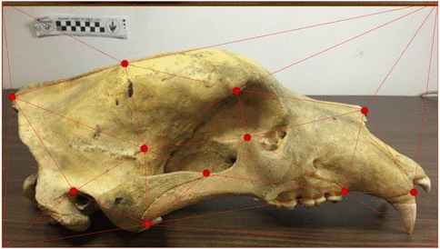
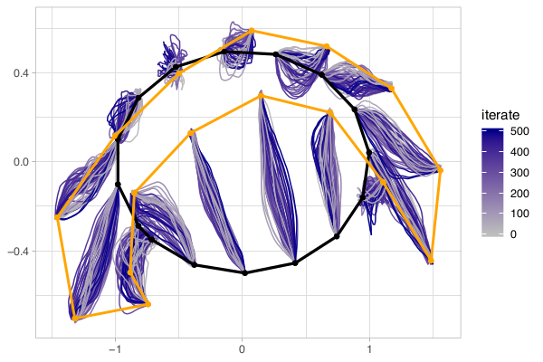

[](https://travis-ci.com/mschauer/BridgeLandmarks.jl)
[](https://doi.org/10.5281/zenodo.3629353)
[](https://mschauer.github.io/BridgeLandmarks.jl/dev)
[](https://arxiv.org/abs/2002.00885)


# BridgeLandmarks 

   
   
*Fig.:* Landmarks on two bear skulls were marked as red points giving two landmark configurations. The "evolutionary change" from one configuration to the other can be modelled 
by a stochastic differential equation for landmark trajectories in a Hamiltonian manifold. The animation illustrates the deformation the landmark configurations found by our method. Source for the pictures:
https://wildlifesnpits.wordpress.com/2016/03/23/landmark-studies-for-evolution/


## Image analysis and stochastic processes on shape and landmark manifolds

In this Julia package makes the algorithms from the following paper
are made available for general use, additionally it contains the scripts required to reproduce the numerical experiments in that paper:

> Alexis Arnaudon, Frank van der Meulen, Moritz Schauer, Stefan Sommer:
> 
> *Diffusion bridges for stochastic hamiltonian systems with applications to shape analysis*, 2020.
>
> Abstract: Stochastically evolving geometric systems are studied in geometric mechanics for modelling turbulence parts of multi-scale fluid flows and in shape analysis for stochastic evolutions of shapes of e.g. human organs. Recently introduced models involve stochastic differential equations that govern the dynamics of a diffusion process X. In applications X is only partially observed at times 0 and T > 0. Conditional on these observations, interest lies in inferring parameters in the dynamics of the dif- fusion and reconstructing the path (Xt, t ∈ [0,T]). The latter problem is known as bridge simulation. We develop a general scheme for bridge sampling in the case of fi- nite dimensional systems of shape landmarks and singular solutions in fluid dynamics. This scheme allows for subsequent statistical inference of properties of the fluid flow or the evolution of observed shapes. It covers stochastic landmark models for which no suitable prior simulation method has been proposed in the literature, that removes restrictions of earlier approaches, improves the handling of the nonlinearity of the con- figuration space leading to more effective sampling schemes, and allows to generalise the common inexact matching scheme to the stochastic setting.


   
   
*Fig.:* Starting from an ellipse (initial shape, black), 16 landmarks are transformed representing points on the outline of a human *corpus callosum* (final shape, orange). Here we used the Trouve-Vialard model (Example 4 of the paper.) The landmarks move along randomized ergodesics, the variation of the samples of these curves capture the uncertainty about the actual deformation that took place.

# Requirements
Some of the experiements depend on addition packages. You can install a number of them with 

```
pkg> add RCall Distributions DataFrames CSV StaticArrays JLD2 TimerOutputs FileIO
```
(open the package manager with `]`)


# References

* Alexis Arnaudon, Frank van der Meulen, Moritz Schauer, Stefan Sommer: Diffusion bridges for stochastic Hamiltonian systems with applications to shape analysis. [arxiv:2002.00885](https://arxiv.org/abs/2002.00885), 2020.
